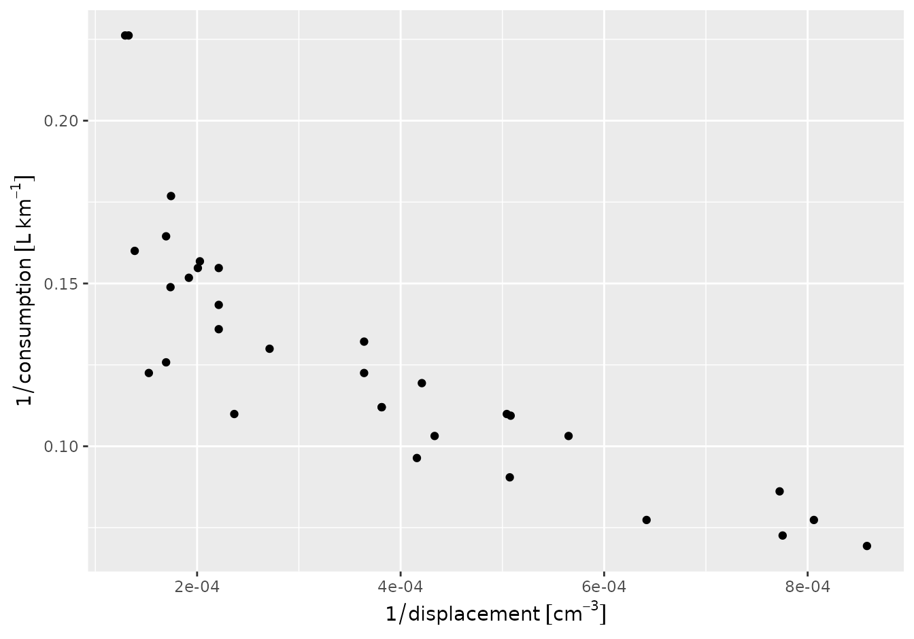

# Measurement units in R

This vignette is identical to Pebesma, Mailund, and Hiebert
([2016](#ref-rj)), except for two changes:

- it has been synchronized with updates to the
  [units](https://cran.r-project.org/package=units) package
- it has been converted to R-markdown

## Abstract

We briefly review SI units, and discuss R packages that deal with
measurement units, their compatibility and conversion. Built upon the
UNIDATA udunits library, we introduce the package
[units](https://cran.r-project.org/package=units) that provides a class
for maintaining unit metadata. When used in expression, it automatically
converts units, and simplifies units of results when possible; in case
of incompatible units, errors are raised. The class flexibly allows
expansion beyond predefined units. Using
[units](https://cran.r-project.org/package=units) may eliminate a whole
class of potential scientific programming mistakes. We discuss the
potential and limitations of computing with explicit units.

## Introduction

Two quotes from Cobb and Moore ([1997](#ref-cobb)) – *Data are not just
numbers, they are numbers with a context* and *in data analysis, context
provides meaning* – illustrate that for a data analysis to be
meaningful, knowledge of the data’s context is needed. Pragmatic aspects
of this context include who collected or generated the data, how this
was done, and for which purpose ([Scheider et al. 2016](#ref-scheider));
semantic aspects concern what the data represents: which aspect of the
world do the data refer to, when and where were they measured, and what
a value of `1` means.

R does allow for keeping some context with data, for instance

- `data.frame` columns must have and `list` elements may have names that
  can be used to describe context, using freetext
- `matrix` or `array` objects may have `dimnames`
- for variables of class `factor` or `ordered`, `levels` may indicate,
  using freetext, the categories of nominal or ordinal variables
- `POSIXt` and `Date` objects specify how numbers should be interpreted
  as time or date, with fixed units (second and day, respectively) and
  origin (Jan 1, 1970, 00:00 UTC)
- `difftime` objects specify how time duration can be represented by
  numbers, with flexible units (secs, mins, hours, days, weeks);
  [lubridate](https://cran.r-project.org/package=lubridate) ([Grolemund
  and Wickham 2011](#ref-lubridate)) extends some of this functionality.

Furthermore, if spatial objects as defined in package
[sp](https://cran.r-project.org/package=sp) ([Pebesma and Bivand
2005](#ref-sp)) have a proper coordinate reference system set, they can
be transformed to other datums, or converted to various flat (projected)
representations of the Earth ([Iliffe and Lott 2008](#ref-iliffe)).

In many cases however, R drops contextual information. As an example, we
look at annual global land-ocean temperature index (from
`http://climate.nasa.gov/vital-signs/global-temperature/`) since 1960:

``` r
temp_data = subset(read.table("647_Global_Temperature_Data_File.txt", 
    header=TRUE)[1:2], Year >= 1960)
temp_data$date = as.Date(paste0(temp_data$Year, "-01-01"))
temp_data$time = as.POSIXct(temp_data$date)
Sys.setenv(TZ="UTC")
head(temp_data, 3)
##    Year Annual_Mean       date       time
## 81 1960       -0.03 1960-01-01 1960-01-01
## 82 1961        0.05 1961-01-01 1961-01-01
## 83 1962        0.02 1962-01-01 1962-01-01
year_duration = diff(temp_data$date)
mean(year_duration)
## Time difference of 365.2545 days
```

Here, the time difference units are reported for the `difftime` object
`year_duration`, but if we would use it in a linear algebra operation

``` r
year_duration %*% rep(1, length(year_duration)) / length(year_duration)
##          [,1]
## [1,] 365.2545
```

the unit is dropped. Similarly, for linear regression coefficients we
see

``` r
coef(lm(Annual_Mean ~ date, temp_data))
##  (Intercept)         date 
## 1.833671e-02 4.364763e-05
coef(lm(Annual_Mean ~ time, temp_data))
##  (Intercept)         time 
## 1.833671e-02 5.051809e-10
```

where the unit of change is in degrees Celsius but either *per day*
(`date`) or *per second* (`time`). For purely mathematical
manipulations, R often strips context from numbers when it is carried in
attributes, the linear algebra routines being a prime example.

Most variables are somehow attributed with information about their
*units*, which specify what the value `1` of this variable represents.
This may be counts of something, e.g. `1 apple`, but it may also refer
to some *physical unit*, such as distance in meter. This article
discusses how strong unit support can be introduced in R.

## SI

The [BIPM](https://www.bipm.org/) (Bureau International des Poids et
Mesures) is “*the intergovernmental organization through which Member
States act together on matters related to measurement science and
measurement standards. Its recommended practical system of units of
measurement is the International System of Units (Système International
d’Unités, with the international abbreviation SI)*
(<https://www.bipm.org/en/measurement-units/>)”.

International Bureau of Weights and Measures, Taylor, and Thompson
([2001](#ref-si)) describe the SI units, where, briefly, *SI units*

- consist of seven base units (length, mass, time & duration, electric
  current, thermodynamic temperature, amount of substance, and luminous
  intensity), each with a name and abbreviation (see table below)
- consist of *derived units* that are formed by products of powers of
  base units, such as m/s$^{2}$, many of which have special names and
  symbols (e.g. angle: 1 rad = 1 m/m; force: 1 N = 1 m kg s$^{- 2}$)
- consist of *coherent derived units* when derived units include no
  numerical factors other than one (with the exception of `kg`; as a
  base unit, kg can be part of coherent derived units); an example of a
  coherent derived unit is 1 watt = 1 joule per 1 second,
- may contain SI prefixes (k = kilo for $10^{3}$, m = milli for
  $10^{- 3}$, etc.)
- contain special quantities where units disappear (e.g., m/m) or have
  the nature of a count, in which cases the unit is 1.

base quantities, SI units and their symbols (from International Bureau
of Weights and Measures, Taylor, and Thompson ([2001](#ref-si)), p. 23):

| Base quantity             |               | SI base unit |        |
|---------------------------|---------------|--------------|--------|
| Name                      | Symbol        | Name         | Symbol |
| length                    | $l,x,r,$ etc. | meter        | m      |
| mass                      | $m$           | kilogram     | kg     |
| time, duration            | $t$           | second       | s      |
| electric current          | $I,i$         | ampere       | A      |
| thermodynamic temperature | $T$           | kelvin       | K      |
| amount of substance       | $n$           | mole         | mol    |
| luminous intensity        | $I_{v}$       | candela      | cd     |

## Related work in R

Several R packages provide unit conversions. For instance,
[measurements](https://cran.r-project.org/package=measurements) ([Birk
2016](#ref-measurements)) provides a collection of tools to make working
with physical measurements easier. It converts between metric and
imperial units, or calculates a dimension’s unknown value from other
dimensions’ measurements. It does this by the `conv_unit` function:

``` r
library(measurements)
conv_unit(2.54, "cm", "inch")
## [1] 1
conv_unit(c("101 44.32","3 19.453"), "deg_dec_min", "deg_min_sec")
## [1] "101 44 19.2000000000116" "3 19 27.1800000000003"
conv_unit(10, "cm_per_sec", "km_per_day")
## [1] 8.64
```

but uses for instance `kph` instead of `km_per_hour`, and then
`m3_per_hr` for flow – unit names seem to come from convention rather
than systematic composition. Object `conv_unit_options` contains all 173
supported units, categorized by the physical dimension they describe:

``` r
names(conv_unit_options)
##  [1] "acceleration" "angle"        "area"         "coordinate"   "count"       
##  [6] "duration"     "energy"       "file_size"    "flow"         "length"      
## [11] "mass"         "power"        "pressure"     "speed"        "temperature" 
## [16] "torque"       "volume"
conv_unit_options$volume
##  [1] "ul"        "uL"        "ml"        "mL"        "dl"        "dL"       
##  [7] "l"         "L"         "cm3"       "dm3"       "m3"        "km3"      
## [13] "us_tsp"    "us_tbsp"   "us_oz"     "us_cup"    "us_pint"   "us_quart" 
## [19] "us_gal"    "inch3"     "in3"       "ft3"       "mi3"       "imp_tsp"  
## [25] "imp_tbsp"  "imp_oz"    "imp_cup"   "imp_pint"  "imp_quart" "imp_gal"
```

Function `conv_dim` allows for the conversion of units in products or
ratios, e.g.

``` r
conv_dim(x = 100, x_unit = "m", trans = 3, trans_unit = "ft_per_sec", y_unit = "min")
## [1] 1.822689
```

computes how many minutes it takes to travel 100 meters at 3 feet per
second.

Package [NISTunits](https://cran.r-project.org/package=NISTunits) ([Gama
2014](#ref-NISTunits)) provides fundamental physical constants
(Quantity, Value, Uncertainty, Unit) for SI and non-SI units, plus unit
conversions, based on the data from NIST (National Institute of
Standards and Technology). The package provides a single function for
every unit conversion; all but 5 from its 896 functions are of the form
`NISTxxxTOyyy` where `xxx` and `yyy` refer to two different units. For
instance, converting from W m$^{- 2}$ to W inch$^{- 2}$ is done by

``` r
library(NISTunits)
NISTwattPerSqrMeterTOwattPerSqrInch(1:5)
## [1] 0.00064516 0.00129032 0.00193548 0.00258064 0.00322580
```

Both [measurements](https://cran.r-project.org/package=measurements) and
[NISTunits](https://cran.r-project.org/package=NISTunits) are written
entirely in R.

## UNIDATA’s udunits library

Udunits, developed by UCAR/UNIDATA, advertises itself on [its web
page](https://www.unidata.ucar.edu/software/udunits) as: “*The udunits
package supports units of physical quantities. Its C library provides
for arithmetic manipulation of units and for conversion of numeric
values between compatible units. The package contains an extensive unit
database, which is in XML format and user-extendable.*”

Unlike the
[measurements](https://cran.r-project.org/package=measurements) and
[NISTunits](https://cran.r-project.org/package=NISTunits), the
underlying udunits2 C library parses units as expressions, and bases its
logic upon the convertibility of expressions, rather than the comparison
of fixed strings:

``` r
m100_a = paste(rep("m", 100), collapse = "*")
dm100_b = "dm^100"
units::ud_are_convertible(m100_a, dm100_b)
## [1] TRUE
```

This has the advantage that through complex computations, intermediate
objects can have units that are arbitrarily complex, and that can
potentially be simplified later on. It also means that the package
practically supports an unlimited amount of derived units.

## Udunits versus the Unified Code for Units of Measure (UCUM)

Another set of encodings for measurement units is the Unified Code for
Units of Measure (UCUM, Schadow and McDonald ([2009](#ref-ucum))). A
dedicated web site describes the details of the differences between
udunits and UCUM, and provides a conversion service between the two
encoding sets.

The UCUM website refers to some Java implementations, but some of the
links seem to be dead. UCUM is the preferred encoding for standards from
the Open Geospatial Consortium. udunits on the other hand is the units
standard of choice by the climate science community, and is adopted by
the CF (Climate and Forecast) conventions, which mostly uses NetCDF.
NetCDF ([Rew and Davis 1990](#ref-netcdf)) is a binary data format that
is widely used for atmospheric and climate model predictions.

The udunits library is a C library that has strong support from UNIDATA,
and we decided to build our developments on this, rather than on Java
implementations of UCUM with a less clear provenance.

## Handling data with units in R: the units package

The [units](https://cran.r-project.org/package=units) package builds
`units` objects from scratch, e.g. where

``` r
library(units)
## udunits database from /usr/share/xml/udunits/udunits2.xml
x = set_units(1:5, m/s)
str(x)
##  Units: [m/s] num [1:5] 1 2 3 4 5
```

represents speed values in `m/s`. The units `m` and `s` are resolved
from the udunits2 C library (but could be user-defined units).

Units can be used in arbitrary R expressions like

``` r
set_units(1:3, m/s^2)
## Units: [m/s^2]
## [1] 1 2 3
```

Several manipulations with `units` objects will now be illustrated.
Manipulations that do not involve unit conversion are for instance
addition:

``` r
x = set_units(1:3, m/s)
x + 2 * x
## Units: [m/s]
## [1] 3 6 9
```

Explicit unit conversion is done by assigning new units:

``` r
(x = set_units(x, cm/s))
## Units: [cm/s]
## [1] 100 200 300
as.numeric(x)
## [1] 100 200 300
```

similar to the behaviour of `difftime` objects, this modifies the
numeric values without modifying their meaning (what the numbers refer
to).

When mixing units in sums, comparisons or concatenation, units are
automatically converted to those of the first argument:

``` r
y = set_units(1:3, km/h)
x + y
## Units: [cm/s]
## [1] 127.7778 255.5556 383.3333
y + x
## Units: [km/h]
## [1]  4.6  9.2 13.8
x == y
## [1] FALSE FALSE FALSE
c(y, x)
## Units: [km/h]
## [1]  1.0  2.0  3.0  3.6  7.2 10.8
```

where `c(y, x)` concatenates `y` and `x` after converting `x` to the
units of `y`. Derived units are created where appropriate:

``` r
x * y
## Units: [cm*km/(h*s)]
## [1] 100 400 900
x^3
## Units: [cm^3/s^3]
## [1] 1.0e+06 8.0e+06 2.7e+07
```

and meaningful error messages appear when units are not compatible:

``` r
e = try(z <- x + x * y)
## Error : cannot convert cm*km/(h*s) into cm/s
attr(e, "condition")[[1]]
## [1] "cannot convert cm*km/(h*s) into cm/s"
```

The full set of methods and method groups for `units` objects is shown
by

``` r
methods(class = "units")
##  [1] [             [[            [[<-          [<-           all.equal    
##  [6] anyDuplicated as_units      as.data.frame as.Date       as.list      
## [11] as.POSIXct    boxplot       c             cbind         diff         
## [16] drop_units    duplicated    format        hist          log10        
## [21] log2          Math          matrixOps     mean          median       
## [26] mixed_units   Ops           plot          print         quantile     
## [31] rbind         rep           seq           set_units     str          
## [36] summary       Summary       unique        units         units<-      
## [41] weighted.mean
## see '?methods' for accessing help and source code
```

where the method groups

- `Ops` include operations that require compatible units, converting
  when necessary (`+`, `-`, `==`, `!=`, `<`, `>`, `<=`, `>=`), and
  operations that create new units (`*`, `/`, `^` and `**`),
- `Math` include `abs`, `sign`, `floor`, `ceiling`, `trunc`, `round`,
  `signif`, `log`, `cumsum`, `cummax`, `cummin`, and
- `Summary` include `sum`, `min`, `max` and `range`, and all convert to
  the unit of the first argument.

When possible, new units are simplified:

``` r
a = set_units(1:10, m/s)
b = set_units(1:10, h)
a * b
## Units: [m]
##  [1]   3600  14400  32400  57600  90000 129600 176400 230400 291600 360000
ustr1 = paste(rep("m", 101), collapse = "*")
ustr2 = "dm^100"
as_units(ustr1) / as_units(ustr2)
## 1e+100 [m]
```

Units are printed as simple R expressions, e.g.

``` r
set_units(1, m^5/s^4)
## 1 [m^5/s^4]
```

Another way to print units commonly seen in Climate and Forecast
Conventions is `m2 s-1` for m$^{2}$/s. These are not R expressions, but
they can be parsed by `as_units`, and created by `deparse_unit`:

``` r
as_units("m2 s-1")
## 1 [m^2/s]
deparse_unit(set_units(1, m^2*s^-1))
## [1] "m2 s-1"
```

The `plot` and `hist` methods add units to default axis labels, an
example is shown in the following figures. For
[ggplot2](https://cran.r-project.org/package=ggplot2) plots ([Wickham
2009](#ref-ggplot2)), automatic unit placement in default axis label is
also provided; `demo(ggplot2)` gives an example.

``` r
library(units)
units_options(negative_power = TRUE)
# initialize variables with units:
mtcars$consumption = set_units(mtcars$mpg, mi/gallon)
# "in" is also a reserved R keyword, and so needs back-quotes:
mtcars$displacement = set_units(mtcars$disp, `in`^3)
# convert to SI:
mtcars$consumption = set_units(mtcars$consumption, km/l)
mtcars$displacement = set_units(mtcars$displacement, cm^3)
par(mar = par("mar") + c(0, .3, 0, 0))
with(mtcars, plot(1/displacement, 1/consumption))
```


``` r
library(ggplot2)
ggplot(mtcars) + geom_point(aes(x = 1/displacement, y = 1/consumption))
```



Automatic conversion between `units` and `difftime` is provided:

``` r
(dt = diff(Sys.time() + c(0, 1, 1+60, 1+60+3600))) # class difftime
## Time differences in secs
## [1]    1   60 3600
(dt.u = as_units(dt))
## Units: [s]
## [1]    1   60 3600
identical(as_difftime(dt.u), dt)
## [1] TRUE
```

as well as to and from `POSIXct` or `Date`:

``` r
(t1 <- as_units(as.POSIXct("2017-08-20 17:03:00")))
## 1503248580 [seconds since 1970-01-01 00:00:00 +00:00]
(t2 <- as_units(as.POSIXct("2017-08-20 17:03:00"), "hours since 2017-08-20"))
## 17.05 [hours since 2017-08-20]
(d1 <- as_units(as.Date("2017-08-20")))
## 17398 [days since 1970-01-01]
as.POSIXct(t1)
## [1] "2017-08-20 17:03:00 UTC"
as.Date(d1)
## [1] "2017-08-20"
```

Objects of class `units` can be used as columns in `data.frame` objects,
as well as in `tbl_df` ([Wickham, Francois, and Müller
2016](#ref-tibble)). They can also be `matrix` or `array`, with the
constraint that a single unit holds for all elements.

## Discussion and conclusions

The [units](https://cran.r-project.org/package=units) R package provides
a new class, `units`, for numeric data with associated measurement
units. Operations on objects of this class retain the unit metadata and
provide automated dimensional analysis: dimensions are taken into
consideration in computations and comparisons. Combining different units
that are compatible triggers automatic unit conversion, derived units
are automatically generated and simplified where possible, and
meaningful error messages are given when a user tries to add objects
with incompatible units. This verifies that computations are not only
syntactically and numerically allowed, but also semantically, and in the
case of physical units, physically allowed, which may support code
verification and provenance tracking. Using this package may eliminate a
whole class of potential scientific programming mistakes.

Where the R packages
[measurements](https://cran.r-project.org/package=measurements) and
[NISTunits](https://cran.r-project.org/package=NISTunits) provide
conversion between a fixed number of units, with the help of the
udunits2 C library and unit database, R package
[units](https://cran.r-project.org/package=units) handles arbitrarily
complex derived units. By treating units as expressions it can derive,
convert and simplify units. In addition, beyond the SI units packaged,
[units](https://cran.r-project.org/package=units) handles user-defined
units.

Data in `units` vectors can be stored as columns in `data.frame` or
`tbl_df` objects, and can be converted to and from `difftime`. When
`units` objects have associated time and location information, they
could be stored in spatial or spatio-temporal objects provided by
[sp](https://cran.r-project.org/package=sp) or
[spacetime](https://cran.r-project.org/package=spacetime) ([Pebesma
2012](#ref-spacetime)) as these store attribute data in `data.frame`
slots, but for instance not in `zoo` ([Zeileis and Grothendieck
2005](#ref-zoo)) or `xts` ([Ryan and Ulrich 2014](#ref-xts)) objects, as
these latter two set the class attribute of a vector or matrix.

Despite all standardization efforts, units may still be ambiguous, or
subject to interpretation. For instance for the duration of one year
[NISTunits](https://cran.r-project.org/package=NISTunits) gives us an
answer that depends on whether we want a common, leap, Gregorian,
Julian, tropical or siderial year (Lang ([2006](#ref-lang)), see also
`demo(year)`). This illustrates that those who apply unit conversion
should be aware of possible pitfalls. Support for calendars in udunits
seems not as well developed as in R.

Future work includes extending packages that read external data from
formats, databases or interfaces with support for measurement unit
information into R, preserving the measurement unit information.
Examples would be interfaces to HDF5 (e.g.,
[h5](https://cran.r-project.org/package=h5), Annau ([2016](#ref-h5))),
[RNetCDF](https://cran.r-project.org/package=RNetCDF) ([Michna and Woods
2016](#ref-RNetCDF)) or
[sos4R](https://cran.r-project.org/package=sos4R) ([Nüst, Stasch, and
Pebesma 2011](#ref-sos4R)). It would be nice to see units of
measurements propagate into units of regression coefficient estimates.

## Acknowledgements

We acknowledge three anonymous reviewers and the handling editor for
their constructive comments, and Thomas Lin Pedersen for implementing
the ggplot extensions in package `ggforce` (ported to the `units`
package since v0.8-0) that automatically add units to default ggplot
axis labels.

## References

Annau, Mario. 2016. *H5: Interface to the ’HDF5’ Library*.
<https://CRAN.R-project.org/package=h5>.

Birk, Matthew A. 2016. *Measurements: Tools for Units of Measurement*.
<https://CRAN.R-project.org/package=measurements>.

Cobb, George W., and David S. Moore. 1997. “Mathematics, Statistics, and
Teaching.” *American Mathematical Monthly*, 801–23.

Gama, Jose. 2014. *NISTunits: Fundamental Physical Constants and Unit
Conversions from NIST*. <https://CRAN.R-project.org/package=NISTunits>.

Grolemund, Garrett, and Hadley Wickham. 2011. “Dates and Times Made Easy
with Lubridate.” *Journal of Statistical Software* 40 (1): 1–25.
<https://doi.org/10.18637/jss.v040.i03>.

Iliffe, Jonathan, and Roger Lott. 2008. *Datums and Map Projections: For
Remote Sensing, GIS and Surveying*. CRC Inc.

International Bureau of Weights and Measures, Barry N Taylor, and Ambler
Thompson. 2001. “The International System of Units (SI).”

Lang, K. R. 2006. *Astrophysical Formulae Volume II: Space, Time, Matter
and Cosmology, 3rd Edition 1999. 2nd Printing*. Springer.

Michna, Pavel, and Milton Woods. 2016. *RNetCDF: Interface to NetCDF
Datasets*. <https://CRAN.R-project.org/package=RNetCDF>.

Nüst, D., C. Stasch, and E. J. Pebesma. 2011. “Advancing Geoinformation
Science for a Changing World.” In, edited by S. Geertman, W. Reinhardt,
and F. Toppen, 227–46. Lecture Notes in Geoinformation and Cartography.
Springer.

Pebesma, Edzer. 2012. “Spacetime: Spatio-Temporal Data in R.” *Journal
of Statistical Software* 51 (1): 1–30.
<https://doi.org/10.18637/jss.v051.i07>.

Pebesma, Edzer, and Roger Bivand. 2005. “Classes and Methods for Spatial
Data in R.” *R News* 5: 9–13. <https://cran.r-project.org/doc/Rnews/>.

Pebesma, Edzer, Thomas Mailund, and James Hiebert. 2016. “Measurement
Units in R.” *The R Journal* 8 (2): 486–94.
<https://doi.org/10.32614/RJ-2016-061>.

Rew, Russ, and Glenn Davis. 1990. “NetCDF: An Interface for Scientific
Data Access.” *IEEE Computer Graphics and Applications* 10 (4): 76–82.

Ryan, Jeffrey A., and Joshua M. Ulrich. 2014. *Xts: eXtensible Time
Series*. <https://CRAN.R-project.org/package=xts>.

Schadow, Gunther, and Clement J McDonald. 2009. “The Unified Code for
Units of Measure.” *Regenstrief Institute and UCUM Organization:
Indianapolis, IN, USA*.

Scheider, Simon, Benedikt Gräler, Edzer Pebesma, and Christoph Stasch.
2016. “Modeling Spatiotemporal Information Generation.” *International
Journal of Geographical Information Science* 30 (10): 1980–2008.
<https://dx.doi.org/10.1080/13658816.2016.1151520>.

Wickham, Hadley. 2009. *Ggplot2: Elegant Graphics for Data Analysis*.
Springer-Verlag New York.

Wickham, Hadley, Romain Francois, and Kirill Müller. 2016. *Tibble:
Simple Data Frames*. <https://CRAN.R-project.org/package=tibble>.

Zeileis, Achim, and Gabor Grothendieck. 2005. “Zoo: S3 Infrastructure
for Regular and Irregular Time Series.” *Journal of Statistical
Software* 14 (6): 1–27. <https://doi.org/10.18637/jss.v014.i06>.
